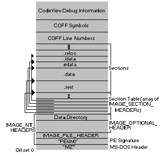
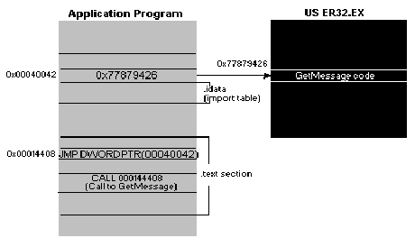
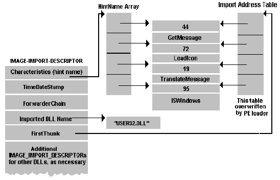
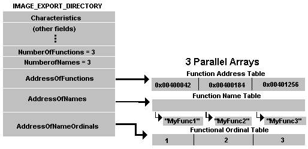
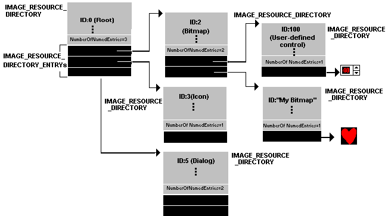

—— Win32可移植可执行文件格式之旅

作者：Matt Pietrek

<!--more-->

一种操作系统之上的可执行文件格式从许多方面反映了这种操作系统本身的情况。尽管研究可执行文件格式并不是大多数程序员的首要任务，但从中你却能够获得许多知识。在本文中，我要带你游历可移植可执行（Portable Executable，PE）文件格式，它是Microsoft设计用于所有基于Win32?的系统，包括Windows NT?、Win32s?以及Windows 95之上的可执行文件格式。在可预见的将来，PE格式会在Microsoft的所有操作系统中扮演重要角色，其中包括Windows 2000。如果你使用过Win32s或Windows NT，那么你已经使用过PE文件了。即使你只是使用Visual C++?为Windows 3.1编写程序，你也使用了PE文件（Visual C++的32位MS-DOS?扩展组件使用这种格式）。简而言之，PE格式已经深入到各种系统以及系统的各个角落，在将来不可避免要碰到它。现在是找出这种新型的可执行文件格式到底给操作系统带来了什么好处的时候了。

我并不是让你从无穷无尽的十六进制数据的角度去研究PE文件格式，也不是让你记住整页整页的PE文件中各个位的含义。相反，我要向你呈现嵌入在PE文件格式中的内容以及它们与你日常工作之间的关系。例如下面的语句中涉及到的线程局部变量的概念：

```
    __declspec(thread) int i;
```

曾经几乎让我发疯，直到我看到它在可执行文件中是如何简洁优美地被实现的。由于你们中许多人都来自16位的Windows，所以我会把Win32 PE文件格式的结构与16位NE文件格式中等价的内容作一比较。

除了不同的可执行文件格式之外，Microsoft也在他的编译器和汇编程序生成的目标文件中使用了新的格式。这种新的OBJ文件格式与PE可执行文件格式有许多相同的地方。我虽然试图去寻找这种新的OBJ文件格式的文档，但最终一无所获。因此我要以自己的方式来解密这种格式，在这里我除了讲解PE格式之外也会讲解它的部分内容。

众所周知，Windows NT继承自VAX? VMS?和UNIX。Windows NT的许多创建者在到Microsoft之前都曾为这些平台设计和编写程序。当他们设计Windows NT时，很自然会使用以前写过的和测试过的工具以尽快开始他们的新项目。这些工具产生的和使用的可执行文件和目标模块的格式被称为COFF（Common Object File Format的首字母，通用目标文件格式）。你从COFF的一些域所用的竟然是八进制形式的数据就可以看出它是多么老。COFF格式本身是很好的起点，但需要扩充才能满足现代操作系统，例如Windows NT或者Windows 95的需要。结果就产生了可移植可执行格式。它之所以被称为“可移植”是因为Windows NT在各种平台（x86、MIPS?、Alpha等等）上的所有实现都使用同样的可执行文件格式。当然，像CPU指令的二进制编码之类的内容会有所不同。重要的是操作系统加载器和编程工具不需要针对遇到的每种新的CPU再完全重写。

从Microsoft抛弃现有的32位工具和文件格式上可以看出它承诺让Windows NT运行得更快的决心。16位Windows上的虚拟设备驱动程序使用的是不同的32位文件格式——LE格式，它在Windows NT出现之前很早就出现了。比这更重要的是更换了OBJ文件的格式。在Windows NT的C编译器之前，所有的Microsoft编译器使用的都是Intel的OMF（Object Module Format，目标模块格式）规范。正如前面提到的那样，Microsoft的Win32编译器产生的都是COFF格式的OBJ文件。一些Microsoft的竞争者，例如Borland和Symantec，放弃COFF格式的OBJ而继续使用Intel OMF格式。结果导致这些公司为多个编译器产生的OBJ或LIB文件需要针对不同的编译器发布不同的版本。

PE格式被公开在WINNT.H头文件中（非常零散）。大概在WINNT.H文件的中间有一个“Image Format”节。这个节以MS-DOS MZ格式和NE格式开头，后面才是新的PE格式。WINNT.H提供了PE文件使用的原始数据结构的定义，但是它包含的关于这些结构和标志的意义的有用注释却很少。为PE格式写头文件的人（Michael J. O'Leary）一定特别喜欢冗长的、描述性的名称，以及嵌套很深的结构和宏。当使用WINNT.H编写代码时，你经常会使用类似下面这样的表达式：

```
　　pNTHeader->
　　OptionalHeader.DataDirectory
　　[IMAGE_DIRECTORY_ENTRY_DEBUG].VirtualAddress;
```

为了对WINNT.H中的信息有一个较好的认识，最好阅读Microsoft可移植可执行文件和通用目标文件格式文件规范，可以在直到2001年十月（含）的MSDN Library每季度的光盘中找到。

现在再来看COFF格式的OBJ文件，WINNT.H头文件中包含了COFF格式的OBJ和LIB文件使用的结构定义和类型定义。不幸的是，与上面提到的可执行文件一样，我找不到关于它的任何文档。由于PE文件与COFF格式的OBJ文件非常相似，我觉得是时候把这些文件呈现给大众，并为它们写些文档了。

在阅读PE文件的结构之余，你可能想转储（DUMP）一些PE文件来自己看看这些概念。如果你使用Microsoft?的基于32位的开发工具，它提供的DUMPBIN程序能够剖析PE文件以及OBJ和LIB文件并且能够以易读的形式输出其结果。在所有的PE文件转储工具中，DUMPBIN是最全面的，它甚至有一个很好的选项用来对它处理的文件的代码节进行反汇编。Borland的用户可以使用TDUMP来查看PE可执行文件，但是TDUMP并不能理解COFF格式的OBJ文件。这并不是个大问题，因为首先Borland的编译器根本就不生成COFF格式的OBJ文件。

我已经写了一个PE和COFF格式的OBJ文件的转储程序，称为PEDUMP（见表1），它的输出比DUMPBIN的输出更容易理解。尽管它不包含反汇编程序，也不能处理LIB文件，但其它功能与DUMPBIN一样，并且增加了新的功能。PEDUMP的源代码在MSJ的BBS上可以找到，因此我在这里不列出它的全部代码。我会用它的某些输出实例来解释我要讲解的概念。

表1 PEDUMP.C

```
//--------------------
// PROGRAM: PEDUMP
// FILE:    PEDUMP.C
// AUTHOR: Matt Pietrek - 1993
//--------------------
#include &lt;windows.h&gt;
#include &lt;stdio.h&gt;
#include "objdump.h"
#include "exedump.h"
#include "extrnvar.h"

// 这里是EXEDUMP.C和OBJDUMP.C中使用的全局变量
BOOL fShowRelocations = FALSE;
BOOL fShowRawSectionData = FALSE;
BOOL fShowSymbolTable = FALSE;
BOOL fShowLineNumbers = FALSE;

char HelpText[] =
"PEDUMP - Win32/COFF .EXE/.OBJ file dumper - 1993 Matt Pietrek\n\n"
"Syntax: PEDUMP [switches] filename\n\n"
" /A    include everything in dump\n"
" /H    include hex dump of sections\n"
" /L    include line number information\n"
" /R    show base relocations\n"
" /S    show symbol table\n";

// 打开一个文件，然后对它创建内存映射文件，并调用合适的转储例程
void DumpFile(LPSTR filename)
{
    HANDLE hFile;
    HANDLE hFileMapping;
    LPVOID lpFileBase;
    PIMAGE_DOS_HEADER dosHeader;

    hFile = CreateFile(filename, GENERIC_READ, FILE_SHARE_READ, NULL,
                        OPEN_EXISTING, FILE_ATTRIBUTE_NORMAL, 0);

    if ( hFile = = INVALID_HANDLE_VALUE )
    {   printf("Couldn't open file with CreateFile()\n");
        return; }

    hFileMapping = CreateFileMapping(hFile, NULL, PAGE_READONLY, 0, 0, NULL);
    if ( hFileMapping = = 0 )
    {   CloseHandle(hFile);
        printf("Couldn't open file mapping with CreateFileMapping()\n");
        return; }

    lpFileBase = MapViewOfFile(hFileMapping, FILE_MAP_READ, 0, 0, 0);
    if ( lpFileBase = = 0 )
    {
        CloseHandle(hFileMapping);
        CloseHandle(hFile);
        printf("Couldn't map view of file with MapViewOfFile()\n");
        return;
    }

    printf("Dump of file %s\n\n", filename);

    dosHeader = (PIMAGE_DOS_HEADER)lpFileBase;
    if ( dosHeader->e_magic = = IMAGE_DOS_SIGNATURE )
       { DumpExeFile( dosHeader ); }
    else if ( (dosHeader->e_magic = = 0x014C)    // 它看起来像i386上的COFF
              &amp;&amp; (dosHeader->e_sp = = 0) )       // 格式的OBJ文件吗？
    {
        // 以上两个测试实际是在检测IMAGE_FILE_HEADER.Machine = = i386 (0x14C)
        // 以及IMAGE_FILE_HEADER.SizeOfOptionalHeader = = 0;
        DumpObjFile( (PIMAGE_FILE_HEADER)lpFileBase );
    }
    else
        printf("unrecognized file format\n");
    UnmapViewOfFile(lpFileBase);
    CloseHandle(hFileMapping);
    CloseHandle(hFile);
}

// 处理所有的命令行参数并返回指向文件名参数的指针
PSTR ProcessCommandLine(int argc, char *argv[])
{
    int i;

   for ( i=1; i &lt; argc; i++ )
    {
        strupr(argv[i]);

        // 它是一个选项吗？
        if ( (argv[i][0] = = '-') || (argv[i][0] = = '/') )
        {
            if ( argv[i][1] = = 'A' )
            {   fShowRelocations = TRUE;
                fShowRawSectionData = TRUE;
                fShowSymbolTable = TRUE;
                fShowLineNumbers = TRUE; }
            else if ( argv[i][1] = = 'H' )
                fShowRawSectionData = TRUE;
            else if ( argv[i][1] = = 'L' )
                fShowLineNumbers = TRUE;
            else if ( argv[i][1] = = 'R' )
                fShowRelocations = TRUE;
            else if ( argv[i][1] = = 'S' )
                fShowSymbolTable = TRUE;
        }
        else    // 不是选项，一定是文件名
        {   return argv[i]; }
    }
}

int main(int argc, char *argv[])
{
    PSTR filename;

    if ( argc = = 1 )
    {   printf(    HelpText );
        return 1; }

    filename = ProcessCommandLine(argc, argv);
    if ( filename )
        DumpFile( filename );
    return 0;
}
```

Win32和PE的基本概念

让我们先来回顾一下PE文件设计中的一些基本概念（如图1）。我使用“模块”来指代加载进内存中的可执行文件或DLL的数据、代码和资源。除了你的程序中直接使用的代码和数据外，模块中还包含一些支持性的数据结构供Windows用来确定代码和数据在内存中的位置。在16位Windows中，这些支持性的数据结构位于模块数据库中（通过HMODULE引用的段）。在Win32中，这些数据结构位于PE文件头中，后面我会解释。



图1 PE文件格式

对于PE文件你首先应该知道的是这种可执行文件在磁盘上的格式与它被加载进内存之后（模块）的格式非常相似。Windows加载器并不需要做太多的工作就能从磁盘文件创建进程。加载器使用内存映射文件机制把文件中合适的部分映射到虚拟地址空间。把它比作建筑的话，PE文件就像预制的房子。它本身组成了其中的一部分，后面需要做少量工作把它和其余的内容连接起来（即链接到DLL等）。这种简单的加载方式同样适用于PE格式的DLL。一旦模块已经被加载进内存，Windows就能像其它的内存映射文件那样有效地使用它。

这与16位Windows的情况有很大区别。16位的NE文件加载器读取文件中的某部分内容，然后在内存中创建一个完全不同的数据结构来表示这个模块。当需要被加载代码或数据段时，加载器不得不从全局堆中为新段分配空间，从可执行文件中找出其原始数据的位置，定位到那个位置，读取原始的数据，最后再进行相应的修正（Fixup）。另外，无论段是否已经被丢弃，每个16位模块负责保存它当前使用的所有选择子（Selector），等等。

对Win32来说，模块中的代码、数据、资源、导入表、导出表以及其它所需的数据结构都在一个连续的内存块中。在这种情况下，你只需要知道文件的加载位置即可。通过存储在映像中的一些指针，很容易就能找到模块中的各种信息。

另外一个你需要知道的就是相对虚拟地址（Relative Virtual Address，RVA）。PE文件中的许多域是用RVA来指定的。简单地说，RVA就是文件中某项内容相对于文件加载地址的偏移。例如假设加载器把PE文件映射到了从虚拟地址空间的0x10000地址处开始的内存中。如果映像中的某个表从地址0x10464处开始，，那么它的RVA就是0x464，如下所示：

```
    （虚拟地址）0x10464-（基地址）0x10000) = （RVA）0x00464
```

如果要把一个RVA转化成可用的指针的话，只需要简单地把RVA和模块的基地址相加就可以了。基地址（Base Address）是EXE或DLL被映射到的内存块的起始地址，它在Win32中是一个非常重要的概念。为了方便，Windows NT和Windows 95都把模块的基地址作为这个模块的实例句柄（HINSTANCE）。在Win32中，把一个模块的基地址称为HINSTANCE容易让人误解，因为“实例句柄（Instance Handle）”这个术语来自16位Windows。在16位Windows中，应用程序的每个副本（即实例）有它单独的数据段（和一个相关的全局句柄），这能够把它与这个程序的其它副本区别开，因此称为实例句柄。在Win32中，一个应用程序并不需要与其它程序区别，因为它们并不共享相同的地址空间。但是HINSTANCE这个术语却被Win32保留了下来。对于Win32来说，重要的是你可以通过调用GetModuleHandle来获取你的进程中的某个DLL的指针（模块句柄）来访问这个模块中的信息。

关于PE文件你需要知道的最后一个概念是节（Section）。PE文件中的节大致相当于NE文件中的段（Segment）或资源。节中或者是代码，或者是数据。与段不同的是，节占有连续的内存块，但并无大小的限制。一些节中包含你的程序中定义并且要直接使用的代码或数据，其它节可能是由链接器和库管理程序为你创建的，它们包含对操作系统来说至关重要的信息。在其它一些PE格式的描述中，节有时也被称为对象（object）。但对象一词意思太多，所以我还是把它们称为节。

PE文件头

与其它可执行文件格式一样，PE文件也有许多域用来决定文件的其余部分该如何解释，这些域在固定的位置（或者很容易找到）。PE文件头包含了诸如代码和数据节的位置和大小、文件对操作系统的意义（EXE还是DLL等）、初始化的堆栈大小和其它一些重要的信息，我后面会讲到。与Microsoft的其它可执行文件格式一样，这个主要的文件头并不是位于文件的最前面。在一个典型的PE文件中，它最前面的几百个字节通常是一个MS-DOS占位程序（stub）。这个占位程序通常是输出一句“This program cannot be run in MS-DOS mode.”这样的信息。因此如果你在一个并不支持Win32的环境中运行基于Win32的程序，就会得到这样的一个错误提示信息。当Win32加载器映射PE文件时，它映射的第一个字节就是这个MS-DOS占位程序的第一个字节。确实是这样的。当你启动一个基于Win32的程序时，竟然同时免费得到了一个基于MS-DOS的程序！

与Microsoft的其它可执行文件格式一样，你必须通过查找PE文件头的偏移地址来获取这个实际的文件头，这个偏移地址被保存在MS-DOS占位程序的文件头中。WINNT.H文件中包含了MS-DOS占位程序文件头结构的定义，因此很容易就能找到PE文件头的起始地址。e_lfanew域保存的就是就是实际的PE文件头的相对偏移（如果你喜欢，也可以称为RVA）。要获取在内存中指向PE文件头的指针，只要把这个域的值与映像的基地址相加就可以了，如下所示：

```
// 为了清楚起见，我省略了类型转换与指针转换
pNTHeader = dosHeader + dosHeader->e_lfanew;
```

一旦你有了一个指向PE文件头的指针，一切就变得明朗起来了。PE文件头是一个IMAGE_NT_HEADERS类型的结构，它在WINNT.H文件中定义。这个结构由一个DWORD和两个子结构组成，如下所示：

```
DWORD Signature;
IMAGE_FILE_HEADER FileHeader;
IMAGE_OPTIONAL_HEADER OptionalHeader;
```

Signature域是ASCII文本“PE\0\0”。如果你处理的是16位Windows上的NE文件，你会发现MS-DOS文件头中的e_lfanew域指向的不是PE签名而是NE签名。同样，LE格式中的Signature域会表明它是一个Windows 3.x上的虚拟设备驱动程序（VxD）。LX格式将会表明它是OS/2 2.0版上的可执行文件。

PE文件头中接着PE签名的那个DWORD之后是一个IMAGE_FILE_HEADER类型的结构。这个结构仅包含了文件最基本的信息。看起来这个结构好像还是从最初的那个COFF结构来的，并未修改。除了是PE文件头的一部分外，它也出现在由Microsoft Win32编译器生成的COFF格式的OBJ文件的最前面。这个结构如表2所示。

表2 IMAGE_FILE_HEADER结构

WORD    Machine

文件所适用于的CPU类型。已经定义了以下CPU ID：

| 0x14d | Intel i860 |
|:--- |:--- |
| 0x14c | Intel I386 （486和586也用此ID） |
| 0x162 | MIPS R3000 |
| 0x166 | MIPS R4000 |
| 0x183 | DEC Alpha AXP |


WORD    NumberOfSections

文件中节的数目。

DWORD   TimeDateStamp

链接器（对于OBJ文件来说是编译器）生成此文件的时间。它保存的是自1969年十二月31日下午4：00开始的总秒数。

DWORD   PointerToSymbolTable

COFF符号表的文件偏移。这个域只用于OBJ文件和带COFF调试信息的PE文件。PE文件支持多种调试信息格式，因此调试器应该参考数据目录中IMAGE_DIRECTORY_ENTRY_DEBUG这一项的信息（在后面定义）。

DWORD   NumberOfSymbols

COFF符号表中的符号数，可以参考PointerToSymbolTable域的信息。

WORD    SizeOfOptionalHeader

这个结构后面的可选文件头的大小。在OBJ文件中，这个域为0。在可执行文件中，它是这个结构后面的IMAGE_OPTIONAL_HEADER结构的大小。

WORD    Characteristics

关于文件信息的标志。下面是一些比较重要的值，其它的值在WINNT.H文件中定义。

| 0x0001 | 此文件中不包含重定位信息 |
|:--- |:--- |
| 0x0002 | 此文件是可执行映像（不是OBJ或LIB） |
| 0x2000 | 此文件是动态链接库，不是可执行程序 |

PE文件头的第三个组成部分是一个IMAGE_OPTIONAL_HEADER类型的结构。对于PE文件来说，这一部分并不是可选的。COFF结构允许在标准的IMAGE_FILE_HEADER之外定义一些附加信息。这个结构中的信息是PE设计者认为除IMAGE_FILE_HEADER中的基本信息之外非常重要的信息。

并不是IMAGE_OPTIONAL_HEADER结构中的所有域都很重要。比较重要的是ImageBase和Subsystem这两个域。你可以跳过其中一些域的描述。

表3 IMAGE_OPTIONAL_HEADER结构的域

WORD    Magic

好像是一些类型的签名。它总是0x010B。

BYTE    MajorLinkerVersion

BYTE    MinorLinkerVersion

生成此文件的链接器的版本号。这个数字应该是十进制数而不是十六进制数。典型的版本号是2.23。

DWORD   SizeOfCode

所有的代码节的总大小（已经向上舍入）。通常大部分文件只有一个代码节，因此这个域就是.text节的大小。

DWORD   SizeOfInitializedData

这是组成已初始化的数据的所有节的总大小（不包括代码节）。但好像它与文件中的实际内容并不一致。

DWORD   SizeOfUninitializedData

这是加载器要在虚拟地址空间中提交的节的大小，但这些节在磁盘文件中并不占任何空间。这些节在程序启动时并不需要有特定的值，也被称为未初始化的数据。这些数据通常在.bbs节中。

DWORD   AddressOfEntryPoint

加载器首先执行的地址。这是一个RVA，通常是在.text节中。

DWORD   BaseOfCode

代码节的起始RVA。在内存中，代码节通常位于数据节之前，PE文件头之后。在Microsoft的链接器生成的EXE中，这个RVA通常是0x1000。Borland的TLINK32好像是把映像基址和第一个代码节的RVA相加之后填入到这个域中。

DWORD   BaseOfData

数据节的起始RVA。在内存中，数据节通常是在PE文件头和代码节之后，位于最后面。

DWORD   ImageBase

当链接器生成可执行文件时，它假定这个文件会被映射到内存的一个特定位置。这个特定位置就被保存在这个域中。事先为文件假定一个位置可以让链接器对代码进行优化。如果文件确实被加载器映射到了那个位置，那么在运行前代码并不需要做任何修正。对于用于Windows NT上的可执行文件，这个默认映像基址为0x10000。对于DLL，它为0x400000。在Windows 95上，地址0x10000不能被用于加载32位EXE，因为它位于一个被所有进程所共享的线性地址区域。由于这个原因，Microsoft把基于Win32的可执行文件的默认的基地址改成了0x400000。基地址被默认为是0x10000的早期程序在Windows 95上要花费更长的时间来完成加载，因为加载器必须进行基址重定位。

DWORD   SectionAlignment

当映射进内存时，每个节的起始地址必须保证是这个域的值的倍数。由于分页的原因，默认的节的对齐值为0x1000。

DWORD   FileAlignment

在PE文件中，组成每个节的原始数据必须保证是这个域的值的倍数。默认是0x200字节，很可能是为了保证每个节总是从磁盘的一个扇区（它也是0x200字节长）开始。这个域相当于NE文件中的段/资源对齐值。与NE文件不同的是，PE文件通常并没有成百上千个节，因此由于文件的节的对齐而浪费的空间是非常小的。

WORD    MajorOperatingSystemVersion

WORD    MinorOperatingSystemVersion

要运行此可执行文件所需的最小的操作系统版本号。这个域的含义并不明确，因为Subsystem域（定义在后面）好像也是用于此目的的。到目前为止，在所有的Win32 EXE中它的默认值为1.0。

WORD    MajorImageVersion

WORD    MinorImageVersion

用户定义的域。这允许你的EXE或DLL有不同的版本。你可以通过链接器的/VERSION选项来设定这个域的值。例如，“LINK /VERSION:2.0 myobj.obj”。

WORD    MajorSubsystemVersion

WORD    MinorSubsystemVersion

要运行此可执行文件所需的最小子系统版本号。典型值是3.10（Windows NT 3.1）。

DWORD   Reserved1

好像总是0。

DWORD   SizeOfImage

看起来好像是加载器需要处理的那部分映像的总大小。它是从映像基址开始到最后一个节结束。最后一个节向上舍上到与它最接近的节的对齐值的倍数。

DWORD   SizeOfHeaders

PE文件头和节表的大小。节中的原始数据紧接着所有的文件头部分之后开始。

DWORD   CheckSum

应该是文件的CRC校验和。与Microsoft的其它可执行文件格式一样，这个域的值被忽略，并且总是被设置为0。但是，对于受信任的服务和EXE必须设置一个合法的校验和。

WORD    Subsystem

此程序的用户界面的子系统类型。WINNT.H定义了以下值：

| NATIVE | 1 | 不需要子系统（例如设备驱动程序） |
|:--- |:--- |
| WINDOWS_GUI | 2 | 运行于Windows GUI子系统 |
| WINDOWS_CUI | 3 | 运行于Windows字符模式子系统（控制台应用程序） |
| OS2_CUI | 5 | 运行于OS/2字符模式子系统（OS/2 1.x版本的应用程序） |
| POSIX_CUI | 7 | 运行于Posix字符模式子系统 |

WORD    DllCharacteristics

这个域包含一组标志用于指定在哪种情况下调用DLL的初始化函数（例如DllMain）。它的值好像总是0，但是操作系统还是在四种情况下都调用DLL的初始化函数。

已经定义了以下值：

| 1 | 当DLL被首次加载到进程的地址空间时调用 |
|:--- |:--- |
| 2 | 当线程终止时调用 |
| 4 | 当线程启动时调用 |
| 8 | 当DLL退出时调用 |

DWORD   SizeOfStackReserve

为初始的线程堆栈所保留的虚拟内存的数量。但是并不是这里保留的所有的内存都被提交（看下一个域的描述）。这个域的默认值是0x100000（1MB）。如果你在调用CreateThread时将堆栈大小指定为0，那它就使用这个域指定的值作为堆栈大小。

DWORD   SizeOfStackCommit

为初始的线程堆栈提交的内存的数量。Microsoft链接器默认为0x1000字节（1个页面）而TLINK32默认为两个页面。

DWORD   SizeOfHeapReserve

为初始的进程堆所保留的虚拟内存的数量。这个堆的句柄可以通过调用GetProcessHeap获取。并不是这里保留的所有的内存都被提交（看下一个域的描述）。

DWORD   SizeOfHeapCommit

进程堆中初始提交的内存的数量。默认是一个页面。

DWORD   LoaderFlags

从WINNT.H文件看来，这些标志好像与调试支持有关。我从来没有看到过可执行文件带这两个标志的，也不清楚链接器是如何设置它们的。定义了以下值：

| 1 | 启动进程之前调用断点指令 |
|:--- |:--- |
| 2 | 进程被加载之后将它附加到一个调试器上 |

DWORD   NumberOfRvaAndSizes

数据目录数组中的元素数（见下文）。当前的工具总是把这个域的值设置为16。

```
IMAGE_DATA_DIRECTORY DataDirectory[IMAGE_NUMBEROF_DIRECTORY_ENTRIES]
```

这是一个IMAGE_DATA_DIRECTORY结构的数组。它前面的元素包含了可执行文件的重要部分的起始RVA和大小。数组最后的一些元素当前并未使用。此数组的第一个元素总是导出表（如果存在的话）的地址和大小。第二个元素是导入表的地址和大小，等等。要获取一个完整的数组元素的定义，可以参考WINNT.H文件中的IMAGE_DIRECTORY_ENTRY_XXX定义。这个数组可以让加载器快速地找到映像中某个特定的节（例如导入表），而不需要反复比较每个节的名称来查找。此数组的大部分元素都描述了整个节的数据。但IMAGE_DIRECTORY_ENTRY_DEBUG这个元素却只包含.rdata节中一小部分。

节表

在PE文件头和每个节的原始数据之间是节表。节表就像是包含映像中每个节的信息的电话簿。映像中的节是按它们的起始地址（RVA）来排列的，而不是按字母表顺序。

现在我可以更好地阐明节的概念。在NE文件中，你的程序代码和数据被存储在文件中的单独的“段”中。NE文件头有一部分是一个结构数组，这个结构是供你的程序中的每个段使用的。数组中的每个结构都包含了一个段的信息。段的信息包括段的类型（代码还是数据）、大小以及在文件中的位置。PE文件中的节表与NE文件中的段表类似。与NE文件中的段表不同的是，PE文件中的节表不保存每个代码块或数据块的选择子。相反，每个节表项都保存了文件中的原始数据被映射到的内存的地址。虽然节与32位段类似，但它们并不是单个的段。它们都只是一个进程地址空间中的某段区域。

PE文件不同于NE文件的另一个地方是对那些你的程序并不使用而是由操作系统使用的支持性的数据的管理方式。例如可执行文件使用的DLL列表或者是修正记录表的位置。在NE文件中，资源并不是一个段。尽管它们有相关的选择子，但是资源的信息并不被保存在NE文件头的段表中。相反，资源被移到NE文件头结尾处的一个单独的表中。有关导入函数和导出函数的信息也并不单独成段；它们也被放在NE文件头中。

PE文件就不同了。任何关键的代码或数据都单独成节。因此关于导入函数的信息被存储在它自己单独的节中，模块的导出函数表也是如此。重定位数据亦然。任何可能被程序或操作系统使用的代码或数据都单独成节。

在讨论具体的节之前，我需要讲一下操作系统用来管理节所使用的数据结构。在内存中，紧接着PE文件头的是一个类型为IMAGE_SECTION_HEADER结构的数组。这个数组的元素数目由PE文件头给出（IMAGE_NT_HEADER.FileHeader.NumberOfSections域）。我使用PEDUMP程序输出节表和节的所有域及其属性。表4显示了PEDUMP输出的一个典型的EXE文件的节表，表5是一个OBJ文件的节表。

表4 一个典型的EXE文件的节表

```
01 .text     VirtSize: 00005AFA VirtAddr: 00001000
    raw data offs:   00000400 raw data size: 00005C00
    relocation offs: 00000000 relocations:   00000000
    line # offs:     00009220 line #'s:      0000020C
    characteristics: 60000020
      CODE MEM_EXECUTE MEM_READ

 02 .bss      VirtSize: 00001438 VirtAddr: 00007000
    raw data offs:   00000000 raw data size: 00001600
    relocation offs: 00000000 relocations:   00000000
    line # offs:     00000000 line #'s:      00000000
    characteristics: C0000080
      UNINITIALIZED_DATA MEM_READ MEM_WRITE

 03 .rdata    VirtSize: 0000015C VirtAddr: 00009000
    raw data offs:   00006000 raw data size: 00000200
    relocation offs: 00000000 relocations:   00000000
    line # offs:     00000000 line #'s:      00000000
    characteristics: 40000040
      INITIALIZED_DATA MEM_READ

 04 .data     VirtSize: 0000239C VirtAddr: 0000A000
    raw data offs:   00006200 raw data size: 00002400
    relocation offs: 00000000 relocations:   00000000
    line # offs:     00000000 line #'s:      00000000
    characteristics: C0000040
      INITIALIZED_DATA MEM_READ MEM_WRITE

 05 .idata    VirtSize: 0000033E VirtAddr: 0000D000
    raw data offs:   00008600 raw data size: 00000400
    relocation offs: 00000000 relocations:   00000000
    line # offs:     00000000 line #'s:      00000000
    characteristics: C0000040
      INITIALIZED_DATA MEM_READ MEM_WRITE

 06 .reloc    VirtSize: 000006CE VirtAddr: 0000E000
    raw data offs:   00008A00 raw data size: 00000800
    relocation offs: 00000000 relocations:   00000000
    line # offs:     00000000 line #'s:      00000000
    characteristics: 42000040
      INITIALIZED_DATA MEM_DISCARDABLE MEM_READ
```

图5 一个典型的OBJ文件的节表

```
01 .drectve PhysAddr: 00000000 VirtAddr: 00000000
    raw data offs:   000000DC raw data size: 00000026
    relocation offs: 00000000 relocations:   00000000
    line # offs:     00000000 line #'s:      00000000
    characteristics: 00100A00
      LNK_INFO LNK_REMOVE

 02 .debug$S PhysAddr: 00000026 VirtAddr: 00000000
    raw data offs:   00000102 raw data size: 000016D0
    relocation offs: 000017D2 relocations:   00000032
    line # offs:     00000000 line #'s:      00000000
    characteristics: 42100048
      INITIALIZED_DATA MEM_DISCARDABLE MEM_READ

 03 .data     PhysAddr: 000016F6 VirtAddr: 00000000
    raw data offs:   000019C6 raw data size: 00000D87
    relocation offs: 0000274D relocations:   00000045
    line # offs:     00000000 line #'s:      00000000
    characteristics: C0400040
      INITIALIZED_DATA MEM_READ MEM_WRITE

 04 .text     PhysAddr: 0000247D VirtAddr: 00000000
    raw data offs:   000029FF raw data size: 000010DA
    relocation offs: 00003AD9 relocations:   000000E9
    line # offs:     000043F3 line #'s:      000000D9
    characteristics: 60500020
      CODE MEM_EXECUTE MEM_READ

 05 .debug$T PhysAddr: 00003557 VirtAddr: 00000000
    raw data offs:   00004909 raw data size: 00000030
    relocation offs: 00000000 relocations:   00000000
    line # offs:     00000000 line #'s:      00000000
    characteristics: 42100048
      INITIALIZED_DATA MEM_DISCARDABLE MEM_READ
```


每个IMAGE_SECTION_HEADER结构如表6所示。注意一个节中的哪些信息并未被保存在这个结构中。首先看到的就是没有任何内容指示PRELOAD属性。NE文件格式允许你为一个段指定PRELOAD属性，以便在加载模块时同时也加载它。OS/2? 2.0 的LX格式也有类似的内容，允许你指定多达八页的预加载内容。但PE文件并无这一内容。Microsoft对Win32的请求页面调度（demand-paged）加载的性能非常自信。

表6 IMAGE_SECTION_HEADER结构

```
BYTE    Name[IMAGE_SIZEOF_SHORT_NAME]
```

这是一个8字节的ANSI字符串（并不是UNICODE），它是节的名称。大多数节名都以“.“开始（例如“.text”），但这并不是必须的。你可以在汇编语言中用段指令来命名你的节，也可以在Microsoft C/C++编译器中用“#pragma data_seg”和

“#pragma code_seg”来命名你的节。不过要注意，如果节名长8字节的话，那就没有最后的那个NULL字节。如果你是printf爱好者，你可以使用%.8s来避免将名称字符串复制到一个能以NULL结尾的缓冲区中。

```
union {
    DWORD   PhysicalAddress;
    DWORD   VirtualSize;
} Misc;
```

这个域在EXE文件和OBJ文件中意义不同。在EXE文件中，它保存的是代码或数据的实际大小。这是在尚未向上舍入到离它最近的文件对齐值的倍数时的大小。这个结构后面的SizeOfRawData域（看起来命名好像不太恰当）保存的是已经舍入后的值。Borland的链接器把这两个域的意义颠倒了过来，反而好像是正确的。对OBJ文件来说，这个域指出了节的物理地址。第一个节的地址是0。要找出OBJ文件中下一个节的地址，只需在当前节的物理地址上加上SizeOfRawData域的值就可以了。

DWORD   VirtualAddress

在EXE文件中，这个域保存了这个节应该被加载器映射到的地址的RVA。要计算一个给定的节在内存中的实际起始地址，把映像的基地址与这个域的值相加就可以了。当使用Microsoft的工具时，第一个节的默认RVA是0x1000。对于OBJ文件来说，这个域是无意义的，它被设置为0。

DWORD   SizeOfRawData

在EXE文件中，这个域保存了节的大小（已经向上舍入到离它最近的文件对齐值的倍数）。例如假设文件对齐值是0x200。如果前面的VirtualSize域指出这个节的大小是0x35A字节时，这个域会指明这个节的大小为0x400字节。对于OBJ文件来说，这个域包含了由编译器或汇编程序生成的节的精确大小。换句话说，在OBJ文件中，这个域与EXE中的VirtualSize域等价。

DWORD   PointerToRawData

这是基于文件的偏移，在这个偏移处可以找到由编译器或汇编程序生成的原始数据。如果你的程序自己映射PE或COOF文件（而不是让操作系统加载它）的话，这个域比VirtualAddress域更重要。在这种情况下，你实际进行的是完全的线性映射，你会发现节的数据在这个偏移处，而不是在由VirtualAddress指定的RVA处。

DWORD   PointerToRelocations

在OBJ文件中，这是基于文件的偏移，在这个偏移处你可以找到这个节的重定位信息。OBJ文件的每个节的重定位信息紧跟着这个节的原始数据。在EXE文件中，这个域（以及这个结构中以后的域）都是无意义的，它们都被设置为0。在链接器创建EXE文件时，它已经处理了大部分的修正问题，只剩下基地址重定位和导入函数留在加载时解析。有关基址重定位和导入函数的信息被保存在它们各自的节中，因此对于EXE文件来说，并不需要在每个节中原始的数据之后都保存重定位信息。

DWORD   PointerToLinenumbers

这是基于文件的偏移，在这个偏移处你可以找到行号表。行号表使源文件中的行号与相应行生成的代码关联了起来。在现代的调试信息格式中，例如CodeView格式，行号信息作为调试信息的一部分被保存。但是在COFF调试信息格式中,行号信息与符号名以及类型信息是分开存储的。通常情况下，只有代码节（例如.text）有行号。在EXE文件中，行号在节中的原始数据之后。在OBJ文件中，一个节的行号位于这个节的原始数据和重定位表之后。

WORD    NumberOfRelocations

节中重定位表中重定位信息的数目（前面的PointerToRelocations field域指向重定位表）。这个域好像只与OBJ文件有关。

WORD    NumberOfLinenumbers

节中行号表中行号信息的数目。（前面的PointerToLinenumbers域指向行号表）。

DWORD   Characteristics

大多数程序员称为标志（Flag）的内容，在PE/COFF格式中称为特征（Characteristic）。这个域用一组标志用来指定节的属性（例如代码还是数据、可读还是可写等）。要获取一个节的所有可能的属性的列表，可以参考WINNT.H中的IMAGE_SCN_XXX_XXX定义。以下是一些重要的标志：

0x00000020这个节包含代码。通常与可执行标志（0x80000000）一起设定。

0x00000040这个节包含已初始化的数据。除了可执行的节和.bss节之外，几乎所有的节都设定了这个标志。

0x00000080这个节包含未初始化的数据（例如.bss节）。

0x00000200这个节包含备注或其它类型的信息。典型的使用这个标志的节是由编译器生成的.drectv节，它包含编译器传递给链接器的命令。

0x00000800这个节的内容并不放入最后的EXE文件中。这些节是编译器或汇编程序用来给链接器传递信息的。

0x02000000这个节可以被丢弃，因为一旦它被加载之后，进程就不再需要它了。最常见的可以被丢弃的节是基址重定位节（.reloc）。

0x10000000这个节是共享的。当用于DLL时，这个节中的数据在所有使用这个DLL的进程中是共享的。数据节默认是不共享的，这意味着使用某个DLL的所有进程都有这个节中的数据的私有副本。说得更专业一点就是，共享节告诉内存管理器对这个节的页面映射进行一些额外设置以便使用这个DLL的所有进程都使用同一块物理内存。要使一个节变成共享的，可以在链接时使用SHARED属性。例如“LINK /SECTION:MYDATA,RWS ...”告诉链接器这个叫做MYDATA的节应该被设置成可读、可写和共享的。

0x20000000这个节是可执行的。只要设置了“包含代码”标志（0x00000020），通常也会设置这个标志。

0x40000000这个节是可读的。EXE文件中的节总是设置这个标志。

0x80000000这个节是可写的。如果EXE文件的节没有设置这个标志，加载器会把映射的页面都标记成只读和只执行的。通常.data和.bss节被设置这个属性。有趣的是.idata节也设置了这个标志。

PE格式中不存在的另一个概念是页表。OS/2上的LX格式中对应于上述IMAGE_SECTION_HEADER结构的内容中并不直接指向文件中的代码和数据。相反，它使用了一个页查找表，这个表中指定了节的页面中指定范围内的属性和位置。PE格式抛弃了所有这些，它确保一个节中的所有数据会被保存在文件中连续的位置上。比较这两种格式可以看出，LX格式提供了更多的灵活性，但是PE格式却更简单，也更容易使用。

PE格式中另一个受到欢迎的改变是所有的位置都保存为一个简单的DWORD类型的偏移。在NE格式中，几乎所有的位置都是作为扇区值来保存的。为了找出真实的偏移，你首先需要查找NE文件头中的对齐单元的大小，并把它转换成扇区的大小（通常是16或512字节），然后用指定的扇区偏移乘以扇区大小得到实际的文件偏移。如果NE文件中碰巧一些内容不是以扇区偏移来保存的，它也可能以相对于NE文件头的偏移来保存。由于NE文件头并不是在文件的开始部分，你需要在自己的代码中处理NE文件头的偏移。总而言之，PE格式比NE、LX和LE等格式容易得多（假设你会使用内存映射文件）。

常用的节

我们已经知道了节的一般概念以及它们的位置，现在让我们来看一下在EXE和OBJ文件中经常遇到的节。这个列表并不求全，但一定包含你日常遇到的所有节（甚至你没有注意到的）。

.text节是由编译器或汇编程序生成的所有通用代码组成的。由于PE文件运行于32位模式，并不受限于16位的段，所以不需要把不同源文件产生的代码放在不同的节中。这样，链接器把不同的OBJ文件中的所有.text节连接成一个大的.text节放入EXE文件中。如果你使用的是Borland C++，它的编译器把生成的代码放进一个称为CODE的节中。由Borland C++生成的EXE文件中有一个节叫做CODE而不是.text。我一会儿会解释它。

我觉得找出.text节中那些不是由自己创建的也不是从运行时库中获得的代码比较有意思。在PE文件中，当你调用其它模块中的函数（例如USER32.DLL中的GetMessage函数）时，由编译器生成的CALL指令并不是直接把控制权传到了那个DLL中（见图2）。相反，CALL指令把控制权传给了

```
    JMP DWORD PTR [XXXXXXXX]
```

这种形式的指令，而这些指令也在同一.text节中。这种JMP指令通过.idata节中的一个DWORD变量间接跳转。这个.idata节中的DWORD变量包含了操作系统函数的入口点的实际地址。略一思考，我理解了为什么DLL的调用要以这种方式实现。通过把所有对DLL中的同一个函数的调用集中在一处，加载器就不需要对每条调用此函数的指令都进行修正。PE加载器要做的就是把目标函数的正确地址放在.idata节中相应的DWORD变量中。这样就不需要修正任何调用此函数的指令。这与NE文件形成鲜明对比。在NE文件中，每个段都包含了一个这个段中需要修正的位置的列表。如果在这个段中调用DLL中某一函数20次，加载器必须在这个段中写20次这个函数的地址。PE文件的这种方法的不利之处是你不能用一个DLL函数的真实地址来初始化一个变量。例如，你可能认为



图2 调用其它模块中的函数

```
FARPROC pfnGetMessage = GetMessage;
```

将把GetMessage函数的地址放在pfnGetMessage变量中。在16位Windows中，这样确实行得通，但是在Win32中却行不通。在Win32中，变量pfnGetMessage中是JMP DWORD PTR [XXXXXXXX]这条指令的地址，我前面提到过。如果你想通过函数指针来调用，那它会如你所愿。但是如果你想读取GetMessage函数开头的内容，你就不会那么幸运了（除非你做一些附加的工作来跟踪.idata中的“指针”）。我会在后面讨论导入表时再谈起这个话题。


尽管Borland可以让他的编译器生成的节的名称为.text，但是他却将默认节名选成了CODE。在确定PE文件中节的名称时，Borland链接器（TLINK32.EXE）从OBJ文件中提取节名，并把它截断成8个字符（如果需要的话）。


节名不同不是什么大问题，更重要的不同之处在于Borland的PE文件链接到其它模块的方式。正如我在前面提到的，所有对其它模块中的函数的调用是通过JMP DWORD PTR [XXXXXXXX]类型的指令。在Microsoft系统下，EXE文件中的这条指令来自导入库的.text节。因为当你链接到外部的DLL时，是库管理程序（LIB32）创建了导入库（和那条指令），因此链接器本身并不是必须“知道”如何生成那条指令。导入库实际上只是一些链接到PE文件中的代码和数据。


Borland系统处理导入函数的方式只是简单地扩展了16位NE文件对此的处理方式。Borland链接器使用的导入库实际上只是一个函数名以及相应的DLL的名称的列表。TLINK32最终负责确定哪个修正是针对外部DLL的，并且生成相应的JMP DWORD PTR [XXXXXXXX]类型的指令。TLINK32把它生成的这些类型的指令存储在一个称为.icode的节中。

正如.text是默认的代码节一样，.data节是你的已初始化的数据所在的节。这个节由在编译时初始化的全局变量和静态变量组成。它也包含了字符串常量。链接器把OBJ文件和LIB文件中的所有.data节组合成一个.data节放入EXE文件中。局部变量位于线程的堆栈中，它们并不占用.data节或.bss节的空间。

.bss节存储的是所有未初始化的全局变量和静态变量。链接器把OBJ文件和LIB文件中的所有.bss节组合成一个.bss节放入EXE文件中。在节表中，.bss节中的RawDataOffset域被设置为0，这表明这个节不占用文件的任何空间。TLINK并不生成这个节。它通过扩展DATA节的虚拟大小来代替。

.CRT是另一个已初始化数据节，它由Microsoft C/C++运行时库使用，故此得名。为什么这个节中的数据不合并到标准的.data中我不得而知。

.rsrc节包含了模块中所有的资源。在早期的Windows NT中，由16位的RC.EXE生成的RES文件的格式Microsoft的PE链接器并不认识。由CVTRES程序把RES文件转换成COFF格式的OBJ文件，把资源数据放在OBJ文件的.rsrc节中。链接器只是把资源OBJ文件看成一个普通的OBJ文件，这使得链接器并不需要知道关于资源方面的特别知识。最新的Microsoft链接器好像能直接处理RES文件。

.idata节包含一个模块从其它DLL中导入的函数（以及数据）的信息。这个节与NE文件的模块参考表类似。关键区别是PE文件中每个导入的函数都在这个节中专门列出。要在NE文件中找到相同的信息，你必须到每个段中的原始数据最后的重定位信息中去挖掘。

.edata节是PE文件为其它模块导出的函数和数据列表。它相当于NE文件中的入口表、常驻名称表和非常驻名称表的组合。与16位Windows不同，很少需要从EXE文件中导出什么，因此你通常只能在DLL中看到.edata节。当使用Microsoft的工具时，.edata节是通过EXP文件才出现在PE文件中的。也就是说，链接器自己并不生成这种信息。相反，它依赖库管理程序（LIB32）去扫描OBJ文件来生成EXP文件。而链接器把它加入到需要链接的模块列表中。是的，就是这样！这些麻烦的EXP文件其实就是OBJ文件，不过扩展名不同罢了。

.reloc节存储的是基址重定位表。基址重定位是对指令或者已经初始化的变量的值的一种调整，它是在加载器不能把文件加载到链接器设定的位置时才需要进行的。如果加载器把映像加载到了链接器设定的位置上，那么加载器就完全忽略这个节中的重定位信息。如果你想碰碰运气，期望加载器总是把映像加载到设定的基地址上，你可以通过/FIXED选项告诉链接器移除重定位信息。虽然这可以节省可执行文件的空间，但它可能导致可执行文件在其它基于Win32实现的系统上不能运行。例如假定你为Windows NT创建了一个EXE文件，并把它的基地址选在0x10000。如果你告诉链接器移除重定位信息，这个EXE就不能在Windows 95上运行，因为地址0x10000已经被占用了。

注意到由编译器生成的JMP指令和CALL指令使用的是相对于指令本身的偏移地址，而不是32位平坦段中的实际地址这一点是非常重要的。如果映像需要被加载到其它地方而不是链接器设定的那个基地址，这些指令并不需要修改，因为它们用的都是相对寻址。这样，就不需要进行太多的重定位。只有那些使用某些数据的32位偏移地址的指令才需要进行重定位。例如假定你定义了以下全局变量：

```
    int i;
    int *ptr = &amp;i;
```

如果链接器假定映像基址为0x10000，变量i的地址比如说是0x12004。在用于保存指针“ptr”的内存中，链接器将会写入0x12004，因为这是变量i的地址。如果加载器由于某种原因决定把文件加载到从地址0x70000开始的内存处，那么此时变量i的地址将是0x72004。.reloc节是一个映像中的位置列表，在这些位置上由于链接器设定的加载地址与实际的加载地址不同而需要考虑进行重定位。

当你使用编译器指令__declspec(thread)时，你定义的数据并不被放入.data节或者是.bss节，它被放入.tls节，tls代表“线程局部存储（Thread Local Storage）”，它与Win32函数中的TlsAlloc函数家族有关。当处理.tls节时，内存管理器要设置页表，以便无论何时进程切换线程时，一组新的物理内存页面被映射到.tls节的地址空间。这允许基于线程的全局变量。在大多数情况下，使用这种机制比以线程为基础分配内存并把其指针保存在TlsAlloc分配的内存槽上更容易。

对于.tls节和__declspec(thread)变量有一个比较遗憾的地方。在Windows NT和Windows 95上，这种线程局部存储机制不适用于通过调用LoadLibrary而动态加载的DLL。对EXE或者隐含加载的DLL来说，一切正常。如果你不能隐含链接到DLL，但是需要使用基于线程的数据，你就不得不使用TlsAlloc和TlsGetValue并动态分配内存。

尽管.rdata节经常位于.data节和.bss节之间，但你的程序通常看不到也并不使用这个节中的数据。然而.rdata节至少用在两个地方。第一个就是在由Microsoft的链接器生成的EXE中，.rdata节用于保存调试目录，它仅存在于EXE文件中。（如果是TLINK32.EXE，调试目录则是在一个名为.debug的节中。）调试目录是一个类型为IMAGE_DEBUG_DIRECTORY结构的数组。这些结构中保存了有关类型、大小以及位置等各种各样的调试信息。三种主要类型的调试信息是：CodeView?、COFF和FPO。表7是PEDUMP输出的一个典型的调试目录的内容。

| 类型 | 大小 | 地址 | 文件指针 | 特征 | 日期时间 | 版本 |
| --- | --- | --- | --- | --- | --- | --- |
| COFF | 000065C5 | 00000000 | 00009200 | 00000000 | 2CF8CF3D | 0.00 |
| ??? | 00000114 | 00000000 | 0000F7C8 | 00000000 | 2CF8CF3D | 0.00 |
| FPO | 000004B0 | 00000000 | 0000F8DC | 00000000 | 2CF8CF3D | 0.00 |
| CODEVIEW | 0000B0B4 | 00000000 | 0000FD8C | 00000000 | 2CF8CF3D | 0.00 |

表7 一个典型的调试目录

调试目录并非必须位于.rdata节的开始部分。要查找调试目录表，使用数据目录的第七个元素（IMAGE_DIRECTORY_ENTRY_DEBUG）中的RVA。数据目录在PE文件头的末尾。要确定Microsoft链接器生成的调试目录的数目，用调试目录的大小（在数据目录的Size域可以找到）除以IMAGE_DEBUG_DIRECTORY结构的大小即可。TLINK32生成一个简单的数，通常是1。PEDUMP例子程序已经演示了这一点。

.rdata节中的另一个有用部分是描述字符串。如果在你的程序的DEF文件中指定了DESCRIPTION项，则指定的描述字符串就会出现在.rdata节中。在NE格式中，描述字符串总是出现在非常驻名称表的首个元素的位置。描述字符串主要是为了保存一个描述文件的有用字符串。不幸的是，我还没有发现找到它的简便方法。我曾经在一些PE文件中看到描述字符串在调试目录的前面，但是在其它一些文件中它却是在调试目录的后面。我找不到一致的方法去寻找描述字符串（甚至它是否存在）。

类似.debug$S和.debug$T这些节仅存在于OBJ文件中。它们保存了CodeView格式的符号和类型信息。这些节名源自以前的16位编译器使用的用于调试目的的段的名称（$$SYMBOLS和$$TYPES）。.debug$T节的惟一目的是保存PDB文件的路径名，这种PDB文件中包含工程中所有OBJ文件的CodeView信息。链接器从PDB文件中读取信息并创建CodeView信息，并把创建的包含CodeView信息的部分放在最终的PE文件最后。

.drectve节仅存在于OBJ文件中。它包含编译器传给链接器的命令的文本表示。例如在我使用Microsoft编译器生成的所有OBJ文件中都会看到以下的字符串出现在.drectve节：

```
    -defaultlib:LIBC -defaultlib:OLDNAMES
```

当你在代码中使用__declspec(export)时，编译器简单地生成与此等价的命令行并把它放进.drectve节中（例如“-exprot:MyFunction”）。

在使用PEDUMP的过程中，我不时遇到其它类型的节。例如在Windows 95的KERNEL32.DLL中，存在LOCKCODE和LOCKDATA节。推测这些节好像会被特殊对待，从而使它们永远不会从内存中移出。

从中我们可以学到两点。第一，不要认为不使用编译器或汇编程序提供的标准节心里就感到不舒服。如果你由于某些原因要使用单独的节，可以毫不犹豫地创建你自己的节。如果用的是C/C++编译，使用#pragma code_seg和#pragma data_seg就可以了。在汇编语言中，只要在创建32位段时（它最后成为节）使用不同于标准节的名称就可以了。如果你使用TLINK32，你必须使用不同的类或关闭代码段包装。要记住的另一件事是一个不寻常的节名经常可以让你对这个特定的PE文件的目的和实现有一个比较深的了解（ntoskrnl.exe?）。

PE文件的导入表

在前面我已经讲过当一个程序调用外部DLL中的函数时并不直接调用那个DLL中的函数。相反，CALL指令转到了同一个.text节（或者.icode节，如果你使用的是Borland C++的话）中的JMP DWORD PTR [XXXXXXXX]类型的指令。这种JMP指令查找并且将控制权转移到的地址是实际的目标地址。PE文件的.idata节包含了加载器用以确定目标函数的地址并且在可执行映像中修正它们所需的信息。

.idata节（或者称为导入表）以一个类型为IMAGE_IMPORT_DESCRIPTOR结构的数组开始。对于PE文件隐含链接到的每个DLL都有一个相应的IMAGE_IMPORT_DESCRIPTOR结构。并没有域用来指示这个数组中结构的数目。数组中的最后一个元素是通过这个结构中的所有域都是NULL来表明的。IMAGE_IMPORT_DESCRIPTOR结构如表8所示。

图8 IMAGE_IMPORT_DESCRIPTOR结构

DWORD   Characteristics

这个域在以前可能是一个标志。现在Microsoft已经更改了它的意义但是并没有同时更新WINNT.H文件。它实际是一个指针数组的偏移地址（RVA）。其中的每个指针都指向一个IMAGE_IMPORT_BY_NAME结构。

DWORD   TimeDateStamp

指示文件创建日期的日期/时间戳。

DWORD  ForwarderChain

这个域与函数转发（Forward）有关。转发就是把对一个DLL中的某个函数的调用转到另一个DLL的某个函数上。例如在Windows NT上，KERNEL32.DLL就将它的一些导出函数转发到了NTDLL.DLL中。一个应用程序看起来好像调用的是KERNEL32.DLL中的函数，但实际上它调用的是NTDLL.DLL中的函数。这个域包含了FirstThunk数组（马上就要讲到）的索引。被这个域索引的函数会被转发到另一个DLL上。不幸的是，函数是如何转发的这种格式并未公开。转发函数的例子很难找到。

DWORD   Name

这是一个以NULL结尾的ASCII字符串的RVA，这个字符串包含导入的DLL的名称。常见的例子是“KERNEL32.DLL”和“USER32.DLL”。

PIMAGE_THUNK_DATA FirstThunk

这个域是IMAGE_THUNK_DATA共用体的偏移地址（RVA）。几乎在所有情况下，这个共用体都是作为指向IMAGE_IMPORT_BY_NAME结构的指针。如果这个域不是这些指针之一，那推测它应该是那个被导入的DLL所导出的一个序数值。从文档上看并不清楚是否可以只通过序数而不通过名称就能导入函数。

IMAGE_IMPORT_DESCRIPTOR结构中重要的部分是导入的DLL的名称和两个指向IMAGE_IMPORT_BY_NAME结构的指针数组。在EXE文件中，这两个数组（分别由Characteristics域和 FirstThunk域所指向）是并列的，并且由每个数组中的最后一个NULL指针标志着数组结束。这个两个数组中的指针均指向IMAGE_IMPORT_BY_NAME结构。图3是它们的示意图。表9显示了PEDUMP输出的一个导入表的内容。



图3 两个的并列的指针数组

表9 一个典型的EXE文件的导入表

```
GDI32.dll
 Hint/Name Table: 00013064
 TimeDateStamp:   2C51B75B
 ForwarderChain: FFFFFFFF
 First thunk RVA: 00013214
 Ordn Name
    48 CreatePen
    57 CreateSolidBrush
    62 DeleteObject
   160 GetDeviceCaps
    // 表的其余部分省略……

 KERNEL32.dll
 Hint/Name Table: 0001309C
 TimeDateStamp:   2C4865A0
 ForwarderChain: 00000014
 First thunk RVA: 0001324C
 Ordn Name
    83 ExitProcess
   137 GetCommandLineA
   179 GetEnvironmentStrings
   202 GetModuleHandleA
    // 表的其余部分省略……

 SHELL32.dll
 Hint/Name Table: 00013138
 TimeDateStamp:   2C41A383
 ForwarderChain: FFFFFFFF
 First thunk RVA: 000132E8
 Ordn Name
    46 ShellAboutA

 USER32.dll
 Hint/Name Table: 00013140
 TimeDateStamp:   2C474EDF
 ForwarderChain: FFFFFFFF
 First thunk RVA: 000132F0
 Ordn Name
    10 BeginPaint
    35 CharUpperA
    39 CheckDlgButton
    40 CheckMenuItem
    // 表的其余部分省略……
```

对于PE文件导入的每个函数都有一个相应的IMAGE_IMPORT_BY_NAME结构。这个结构非常简单，格式如下：

```
WORD    Hint;
BYTE    Name[?];
```

第一个域是要导入的函数的导出序号。与NE文件不同，这个值不要求绝对正确。加载器只不过是在搜索导出函数时把它作为建议的起始值。接下来的ASCII字符串是导入的函数的名称。

为什么会有两个并列的指向IMAGE_IMPORT_BY_NAME结构的指针数组呢？第一个数组（由Characteristics域指向的那一个）总是保留原样，系统并不修改。它有时也被称为提示名称表（hint-name table）。第二个数组（由FirstThunk域指向的那一个）要被PE加载器修改。加载器首先查找这个数组中每个指针所指向的IMAGE_IMPORT_BY_NAME结构所代表的函数的地址。然后它用找到的这个函数地址来覆盖数组中相应的指向IMAGE_IMPORT_BY_NAME结构的指针。而JMP DWORD PTR [XXXXXXXX]这条指令中的[XXXXXXXX]部分就是这个FirstThunk数组中的某个元素的值。由于被加载器覆盖的这个指针数组最终保存的是导入函数的地址，因此它被称为导入地址表（Import Address Table，IAT）。

如果你是Borland用户，那上面所讲的只需做少许修改即可。由TLINK32生成的PE文件中少了一个数组。在这种可执行文件中，IMAGE_IMPORT_DESCRIPTOR结构（提示名称数组——hint-name array)中的Characteristics域的值是0。因此，只能保证FirstThunk域（导入地址表）所指向的数组存在于所有的PE文件中。故事到这里本身已经结束了，但我却在写PEDUMP时意外地碰到了一个有趣的问题。Microsoft从来就没有停止过对代码的优化，它甚至“优化”了Windows NT的系统DLL（KERNEL32.DLL等）中由FirstThunk指向的那个数组。在这个优化中，那个数组中的指针不再指向IMAGE_IMPORT_BY_NAME结构，它们本身就是导入函数的地址。换句话说，加载器不再需要查找导入函数的地址并把这些地址写入那个数组。这可能会对那些认为那个数组中包含的是指向IMAGE_IMPORT_BY_NAME结构的指针的PE文件转储工具造成麻烦。你可能会想，“Matt，你为什么不只使用提示名称表——Hint Name Table数组呢？”那当然是个理想的方案，但问题是它并不存在于Borland格式的PE文件中。PEDUMP程序处理了所有这些情况，但它的代码相对较难理解。

由于导入地址表是一个可写的节，因此拦截一个EXE或DLL对其它DLL的调用就比较容易。只需要简单地改写导入地址表中相应的元素使它指向所需的拦截函数就可以了（打“补丁”）。并不需要修改任何调用者或被调用者的程序代码。还有比这更简单的吗？

比较有趣的是，在使用Microsoft的工具生成的PE文件中，导入表并不是全部由链接器生成的。所有调用其它DLL中的函数所需的代码块都存在于导入库中。当你链接到一个DLL时，库管理程序（LIB32.EXE或LIB.EXE）扫描将要被链接的OBJ文件并创建一个导入库。这个导入库与16位的NE文件链接器所使用的导入库完全不同。32位的LIB生成的导入库有一个.text节和几个.idata$节。这个.text节包含了JMP DWORD PTR [XXXXXXXX]类型的指令，这种类型的指令在OBJ文件的符号表中有一个对应的名称。这个名称与DLL导出的函数的名称是一样的（例如_DispatchMessage@4）。一个.idata$节包含了JMP DWORD PTR [XXXXXXXX]类型的指令所使用的DWORD值。另一个.idata$节为伴随导入的函数的名称的提示序数（hint ordinal）保留了空间。这两个域就组成了一个IMAGE_IMPORT_BY_NAME结构。当你后面用这个导入库链接PE文件时，这个导入库的节被添加到了链接器所需的OBJ文件的节的列表中。由于导入库中的JMP DWORD PTR [XXXXXXXX]类型的指令的名称与导入的函数的名称相同，因此链接器认为它就是你真正想要导入的函数的代码，它把所有对导入函数的调用都修改成调用这种类型的指令。导入库中的JMP DWORD PTR [XXXXXXXX]类型的指令实际上被当作了导入的函数。

除了提供与导入的函数相应的JMP DWORD PTR [XXXXXXXX]类型的代码外，导入库还提供了PE文件的.idata节（导入表）的代码块。这些代码块来自各种各样的.idata$节，这些节是由库管理程序放入导入库中的。简而言之，链接器并不知道导入的函数和出现在不同的OBJ文件中的真实函数有什么区别。链接器只是按照为它预先设定的规则来创建和组合节，一切自然就顺理成章了。

PE文件的导出表

与导入一些函数相对的就是为其它EXE或DLL导出一些函数。PE文件把有关导出函数的信息保存在.edata节中。通常由Microsoft的链接器生成的PE格式的EXE文件并不导出任何内容，因此它们并没有.edata节。但是Borland的TLINK32总是从EXE中至少导出一个函数。大多数的DLL都导出函数，因此它们都有.edata节。.edata节（导出表）的主要部分是由函数名称、相应的入口点地址和导出序号值组成的表。在NE文件中，入口表、常驻名称表和非常驻名称表合起来与导出表相当。这些表被保存在NE文件头中，而不是在单独的段或资源中。

在.edata节的开始处是一个IMAGE_EXPORT_DIRECTORY结构（见表10）。这个结构后面紧跟着的是它的域所指向的数据。

表10 IMAGE_EXPORT_DIRECTORY结构

DWORD   Characteristics

这个域好像并未使用，总是0。

DWORD   TimeDateStamp

指示文件创建日期的日期/时间戳。

WORD    MajorVersion

WORD    MinorVersion

这些域好像并未使用，总是0。

DWORD   Name

包含这个DLL的名称的ASCII字符串的RVA。

DWORD   Base

导出函数的起始序数。例如如果文件导出的函数的序数分别为10、11、12，那么这个域的值为10。要获得某个函数的导出序数，你需要把这个域的值与AddressOfNameOrdinals数组中的相应元素的值相加。

DWORD   NumberOfFunctions

AddressOfFunctions数组中的元素数目。这个值也是这个模块导出的函数的数目。理论上，这个值可能与NumberOfNames域（下一个域）不同，但实际上它们总是一样的。

DWORD   NumberOfNames

AddressOfNames数组中的元素数目。这个值看起来总是与NumberOfFunctions域的值一样，因此它也是导出的函数的数目。

PDWORD  \*AddressOfFunctions

这个域是一个RVA，并且指向一个函数地址数组。这里的函数地址是这个模块中每个导出的函数的入口点的地址（RVA）。

PDWORD  \*AddressOfNames

这个域是一个RVA，并且指向一个字符串指针数组。这里的字符串是这个模块中导出的函数的名称的字符串。

PWORD   \*AddressOfNameOrdinals

这个域是一个RVA，并且指向一个WORD类型的数组。这里的WORD是这个模块中导出的函数的序号。但是，不要忘记加上Base域指定的起始序号。

导出表的布局有点奇怪（见图4和表10）。我前面已经提到，导出一个函数需要函数的名称、相应的地址和导出序数这三部分内容。你可能认为PE格式的设计者会把这三种信息放在一个结构中，然后用一个这种结构的数组就可以了。但事实是，每个要导出的函数的三部分内容之一都是某个数组中的一个元素。总共有三个这样的数组（AddressOfFunctions，AddressOfNames， AddressOfNameOrdinals），它们是并列的。假如你要查找导出的第四个函数的信息，你需要在每个数组中都查找其第四个元素。



图4 导出表布局

表11 典型的DLL文件的导出表

```
Name:            KERNEL32.dll
 Characteristics: 00000000
 TimeDateStamp:   2C4857D3
 Version:         0.00
 Ordinal base:    00000001
 # of functions: 0000021F
 # of Names:      0000021F

 Entry Pt Ordn Name
 00005090     1 AddAtomA
 00005100     2 AddAtomW
 00025540     3 AddConsoleAliasA
 00025500     4 AddConsoleAliasW
 00026AC0     5 AllocConsole
 00001000     6 BackupRead
 00001E90     7 BackupSeek
 00002100     8 BackupWrite
 0002520C     9 BaseAttachCompleteThunk
 00024C50    10 BasepDebugDump
 // 表中的其余部分省略……
```

顺便说一下，如果你转储Windows NT系统DLL（例如KERNEL32.DLL和USER32.DLL）的导出表，你会发现在很多时候都会有两个函数的名称只有最后一个字母不一样，例如CreateWindowExA和CreateWindowsExW。这就是透明地实现UNICODE支持的方法。以A结尾的函数是与ASCII（或ANSI）兼容的函数，以W结尾的是UNICODE版本的函数。在你自己的代码中，你并不明确指定调用哪个函数，而是由预处理器根据WINDOWS.H中的#ifdef条件编译指令来选择合适的函数。下面这个来自Windows NT的WINDOWS.H文件的片段说明了它是如何工作的：

```
#ifdef UNICODE
#define DefWindowProc DefWindowProcW
#else
#define DefWindowProc DefWindowProcA
#endif // !UNICODE
```


PE文件的资源

查找PE文件中的资源比NE文件稍微复杂一点。单个资源（例如菜单）的格式并没有发生什么大的变化，但你需要通过一个奇怪的层次结构才能找到它们。

浏览资源目录的层次结构就像是浏览硬盘一样。有一个主目录（根目录），它下面有子目录。各个子目录还有它们自己的子目录。这些更下层的子目录可能指向了原始的资源数据（例如对话框模板）。在PE格式中，资源目录层次结构中的根目录和它的子目录都是IMAGE_RESOURCE_DIRECTORY类型的结构（见表12）。

表12 IMAGE_RESOURCE_DIRECTORY结构

DWORD   Characteristics

理论上这个域可能是资源的标志，但它好像总是0。

DWORD   TimeDateStamp

指示资源创建日期的日期/时间戳。

WORD    MajorVersion

WORD    MinorVersion

理论上这些域应该保存资源的版本号，但它们好像总是0。

WORD    NumberOfNamedEntries

本结构后面使用名称的数组元素的个数。

WORD    NumberOfIdEntries

本结构后面使用整数ID的数组元素的个数。

```
IMAGE_RESOURCE_DIRECTORY_ENTRY DirectoryEntries[]
```

这个域实际上并不是IMAGE_RESOURCE_DIRECTORY结构的一部分。它是紧跟在IMAGE_RESOURCE_DIRECTORY结构后面的类型为IMAGE_RESOURCE_DIRECTORY_ENTRY结构的数组。这个数组中的元素数目是NumberOfNamedEntries和NumberOfIdEntries这两个域的和。用名称作为标识的元素（而不是用整数ID）在这个数组的前面一部分。

一个目录项（Directory Entry）或者指向一个子目录（即另外一个IMAGE_RESOURCE_DIRECTORY），或者指向资源的原始数据。通常在你获取资源的原始数据之前，至少要经过三级目录。顶级目录（只有一个）总是位于资源节（.rsrc）的开头。顶级目录的子目录对应于文件中各种类型的资源。例如如果一个PE文件中包含对话框、字符串表和菜单，那将会有三个子目录：一个对话框目录、一个字符串表目录和一个菜单目录。这些类型的子目录中的每一个最终都会有一个ID子目录。对于特定的资源类型的每个实例都会有一个子目录。例如在上面的例子中，如果有三个对话框，那对话框目录将会有三个ID子目录。每个ID子目录或者有一个以字符串表示的名称（例如“MyDialog”），或者有一个整数ID，这个ID就是在RC文件中用于标识资源的。图5以可视化的形式显示了资源目录的层次结构。表13显示的是PEDUMP输出的Windows NT的CLOCK.EXE文件的资源。



图5 资源目录的层次结构

表13 CLOCK.EXE中的资源层次结构

```
ResDir (0) Named:00 ID:06 TimeDate:2C3601DB Vers:0.00 Char:0
    ResDir (ICON) Named:00 ID:02 TimeDate:2C3601DB Vers:0.00 Char:0
        ResDir (1) Named:00 ID:01 TimeDate:2C3601DB Vers:0.00 Char:0
            ID: 00000409 Offset: 00000200
        ResDir (2) Named:00 ID:01 TimeDate:2C3601DB Vers:0.00 Char:0
            ID: 00000409 Offset: 00000210
    ResDir (MENU) Named:02 ID:00 TimeDate:2C3601DB Vers:0.00 Char:0
        ResDir (CLOCK) Named:00 ID:01 TimeDate:2C3601DB Vers:0.00 Char:0
            ID: 00000409 Offset: 00000220
        ResDir (GENERICMENU) Named:00 ID:01 TimeDate:2C3601DB Vers:0.00 Char:0
            ID: 00000409 Offset: 00000230
    ResDir (DIALOG) Named:01 ID:01 TimeDate:2C3601DB Vers:0.00 Char:0
        ResDir (ABOUTBOX) Named:00 ID:01 TimeDate:2C3601DB Vers:0.00 Char:0
            ID: 00000409 Offset: 00000240
        ResDir (64) Named:00 ID:01 TimeDate:2C3601DB Vers:0.00 Char:0
            ID: 00000409 Offset: 00000250
    ResDir (STRING) Named:00 ID:03 TimeDate:2C3601DB Vers:0.00 Char:0
        ResDir (1) Named:00 ID:01 TimeDate:2C3601DB Vers:0.00 Char:0
            ID: 00000409 Offset: 00000260
        ResDir (2) Named:00 ID:01 TimeDate:2C3601DB Vers:0.00 Char:0
            ID: 00000409 Offset: 00000270
        ResDir (3) Named:00 ID:01 TimeDate:2C3601DB Vers:0.00 Char:0
            ID: 00000409 Offset: 00000280
    ResDir (GROUP_ICON) Named:01 ID:00 TimeDate:2C3601DB Vers:0.00 Char:0
        ResDir (CCKK) Named:00 ID:01 TimeDate:2C3601DB Vers:0.00 Char:0
            ID: 00000409 Offset: 00000290
    ResDir (VERSION) Named:00 ID:01 TimeDate:2C3601DB Vers:0.00 Char:0
        ResDir (1) Named:00 ID:01 TimeDate:2C3601DB Vers:0.00 Char:0
            ID: 00000409 Offset: 000002A0
```


前面已经提到，每个目录项是一个IMAGE_RESOURCE_DIRECTORY_ENTRY结构（好家伙，名称越来越长了！）。它的格式如表14所示。

表14 IMAGE_RESOURCE_DIRECTORY_ENTRY结构

DWORD   Name

这个域或者是一个整数ID，或者是指向一个包含字符串名称的结构的指针。如果最高位（0x80000000）是0，那么这个域就被解释为一个整数ID。如果最高位非0，那么它的低31位是一个IMAGE_RESOURCE_DIR_STRING_U结构的偏移地址（相对于资源的开头）。IMAGE_RESOURCE_DIR_STRING_U结构由一个保存字符个数的WORD类型的值和它后面的一个表示资源名称的UNICODE字符串组成。是的，即使PE文件打算用在非UNICODE的Win32系统上，这里也使用UNICODE。要把一个UNICODE字符串转换成ANSI字符串，可以使用WideCharToMultiByte函数。

DWORD   OffsetToData

这个域或者是另一个资源目录的偏移，或者是一个指向有关特定资源实例的信息的指针。如果最高位（0x80000000）置位，那么这个目录项引用的是一个子目录。它的低31位是另一个IMAGE_RESOURCE_DIRECTORY结构的偏移地址（相对于资源的开头）。如果最高位没有置位，那么低31位指向一个IMAGE_RESOURCE_DATA_ENTRY结构。IMAGE_RESOURCE_DATA_ENTRY结构包含了资源的原始数据的位置、它的大小和它的代码页的信息。

如果再往下讨论资源的格式，就不得不涉及到每种资源的类型（对话框、菜单等等）。仅这些内容就能把整篇文章占满，所以在这里我不讨论它们了。

PE文件基址重定位

当链接器创建EXE文件时，它假定这个文件会被映射到内存的某一个地址上。基于此，链接器把代码和数据项的真实地址放在可执行文件中。如果由于某些原因，这个可执行文件不能被加载到这个事先设定的地址上，那么链接器放在这个映像中的地址就变成错误的了。存储在.reloc节中的信息允许PE加载器修正已加载映像中的这些地址以便使它们重新成为正确的地址。另外，如果加载器可以把这个文件加载到事先由链接器设定的基地址上，那么.reloc节就变成多余的了，因此可以被忽略。.reloc节中的每个元素之所以被称为基址重定位信息是因为它们的使用依赖于映像的基地址。

不同于NE文件格式中的重定位，基址重定位相当简单。它们可以简单地归结为映像中的一个地址列表，当加载进内存时，在这些地址上的内容都需要再加上一个值。基址重定位数据的格式有点奇怪。基址重定位项被封装在一系列长度可变的块中。每个块描述了映像中一个4KB的页面范围内的重定位信息。让我们先看一个例子来了解一下基址重定位是如何进行的。假定一个可执行文件在链接时设定的基地址为0x10000。在映像的偏移0x2134处是一个指向某一字符串的指针。这个字符串的起始物理地址是0x14002，因此这个指针的值就为0x14002。然后加载这个文件，但由于某种原因加载器认为应该把这个映像映射到从地址0x60000处开始的内存中。链接器假定的加载地址与实际的加载地址之间的差值称为△（delta，德耳塔，数学中的常用符号，表示差值）。在这个例子中，△是0x50000。由于整个映像在内存中都比原来设定的高0x50000字节，因此刚才提到的那个字符串也是同样（现在它的地址在0x64002）。这样，刚才提到的指向那个字符串的指针中的值现在就不正确了。可执行文件包含了指向那个字符串的指针所在的内存位置的基址重定位信息。为了进行基址重定位，加载器把△值加到要进行基址重定位的地址处原来的值上。因此，加载器将把0x50000加到原来的指针值（0x14002）上，并把结果（0x64002）写回那个指针的内存处。这样，由于字符串确实是在0x64002处，因此就不会出现错误。

每个基址重定位数据块都以一个IMAGE_BASE_RELOCATION结构开始，这个结构如表15所示。表16显示的是PEDUMP输出的某个EXE文件中的一些基址重定位信息。注意：显示的RVA值已经被换成了IMAGE_BASE_RELOCATION结构中的VirtualAddress域的值。

表15 IMAGE_BASE_RELOCATION结构

DWORD   VirtualAddress

这个域包含了这个重定位块的起始RVA。后面每个需要重定位的偏移地址都需要加上这个域的值才能得到实际应该进行重定位的RVA。

DWORD   SizeOfBlock

这个域的值等于这个结构的大小再加上后面的所有重定位信息（每个都是一个WORD值）的总大小。要得到这个块中需要重定位的地址的数目，需要用这个域的值先减去IMAGE_BASE_RELOCATION结构的大小（8字节），然后除以2（WORD类型的大小）。例如，如果这个域的值是44，那么表明它后面有18个需要重定位的地址。计算如下：

```
 (44 - sizeof(IMAGE_BASE_RELOCATION)) / sizeof(WORD) = 18
```

WORD TypeOffset

它不是单个的WORD，而是一个WORD类型的数组，它的元素数目由上面的公式算出。每个WORD的低12位是需要重定位的偏移地址，但是需要加上这个重定位块开头的VirtualAddress域的值才是最终的偏移地址。每个WORD的高4位是重定位的类型。对运行于Intel CPU上的PE文件来说，有以下两种类型的重定位：


| 0 | IMAGE_REL_BASED_ABSOLUTE | 这种重定位是无意义的，它只是一个占位符，用来把重定位块的大小向上舍入到DWORD的倍数。 |
|:--- |:--- |
| 3 | IMAGE_REL_BASED_HIGHLO | 这种重定位意味着把△的高16位和低16位都加到按上面讲的方法计算出的RVA（它是一个DWORD类型）上。 |


表16 一个EXE文件的基址重定位信息

```
Virtual Address: 00001000 size: 0000012C
 00001032 HIGHLOW
 0000106D HIGHLOW
 000010AF HIGHLOW
 000010C5 HIGHLOW
 // 这个块的其余部分省略……
Virtual Address: 00002000 size: 0000009C
 000020A6 HIGHLOW
 00002110 HIGHLOW
 00002136 HIGHLOW
 00002156 HIGHLOW
 // 这个块的其余部分省略……
Virtual Address: 00003000 size: 00000114
 0000300A HIGHLOW
 0000301E HIGHLOW
 0000303B HIGHLOW
 0000306A HIGHLOW
  // 这个块的其余部分省略……
```

PE文件和COFF类型的OBJ文件之间的区别

PE文件中有两部分内容操作系统并不使用，它们是COFF符号表和COFF调试信息。为什么有更全面的CodeView调试信息可用还需要COFF调试信息呢？如果你想使用Windows NT系统调试器（NTSD）或者Windows NT内核调试器（KD），那么COFF是惟一可用的格式。关于PE文件这些部分的内容，我已经给出了详细的描述，有兴趣的读者可以上MSJ的BBS。

在前面的大部分讨论中，我已经指出COFF格式的OBJ文件和由它生成的PE文件中有许多结构和表都是一样的。COFF格式的OBJ和PE文件在（或者接近）它们的开头都有一个IMAGE_FILE_HEADER结构。这个文件头后面跟着的是包含文件中所有节的信息的节表。这两种格式还共享相同的行号和符号表格式，尽管PE文件可以附加非COFF格式的符号表。PEDUMP程序在处理这两种格式的文件时共用了大量代码这一点足以证明它们之间相似的程度非常高（可以参考PEDUMP的COMMON.C文件，在MSJ的BBS上可以找到）。

这两种格式如此相似并不是偶然的。这样设计的目的就是为了让链接器的工作尽可能简单。理论上，从单个的OBJ文件创建一个EXE文件就只是插入一些表并且修改一些文件偏移而已。知道了这些，你就会认为COFF文件是胚胎阶段的PE文件。只有个别内容没有或不一样，因此我把它们全部列在这里：

*   COFF格式的OBJ文件在IMAGE_FILE_HEADER结构之前没有MS-DOS占位程序，也没有“PE”签名。
*   OBJ文件没有IMAGE_OPTIONAL_HEADER结构。在PE文件中，此结构紧跟IMAGE_FILE_HEADER结构。有趣的是，COFF格式的LIB文件却有一个IMAGE_OPTIONAL_HEADER结构。由于文章篇幅所限，我不能在这里讨论LIB文件了。
*   OBJ文件没有基地址重定位。相反，它有一个正常的基于符号的修正。我没有讨论COFF格式的OBJ文件中的重定位，因为它们隐藏的太深了。如果你想挖掘这方面的信息，那么实际上，每个节表项中的PointerToRelocations域和NumberOfRelocations域指向那个节中的重定位信息。重定位信息是一个IMAGE_RELOCATION结构，它被定义在WINNT.H文件中。如果你设定了合适的选项，那PEDUMP程序也可以显示OBJ文件中的重定位信息。
*   OBJ文件中的CodeView信息被存储在两个节（.debug$S和.debug$T）中。当链接器处理OBJ文件时，它并不把这些节放进PE文件中。相反，它把所有这些节组合起来创建单个的符号表并把它存储在文件末尾。符号表并不是一个正式的节（也就是说，在PE文件的节表中，并没有一项是它的位置）。


使用PEDUMP工具

PEDUMP是一个转储PE文件和COFF格式的OBJ文件的命令行工具。它使用Win32控制台从而省去了很多用户界面设置工作。PEDUMP语法如下：

```
         PEDUMP [选项] 文件名
```

如果不带参数运行PEDUMP，会显示所有选项。PEDUMP使用的所有选项如表17所示。在默认情况下，并不使用任何选项。不带任何选项运行PEDUMP，它会提供最有用的信息，并且并不生成大量的输出内容。PEDUMP把它的输出送到了标准的输出文件，因此在命令行上使用“&gt;”可以将它的输出重定向到一个文件。

表17 PEDUMP选项

| /A | 转储所有内容（实际上就是使用所有选项） |
|:--- |:--- |
| /H | 在转储的末尾包含每个节的原始数据的十六进制转储 |
| /L | 包含行号信息（PE文件和COFF格式的OBJ文件均可用） |
| /R | 显示基址重定位信息（仅用于PE文件） |
| /S | 显示符号表信息（PE文件和COFF格式的OBJ文件均可用） |

结束语

随着Win32的到来，Microsoft对OBJ文件和可执行文件格式进行了大规模的更改。为了节省时间，这种格式创建在以前为其它操作系统进行的工作的基础上。这些文件格式的主要目标就是增强不同平台之间的可移植性。
